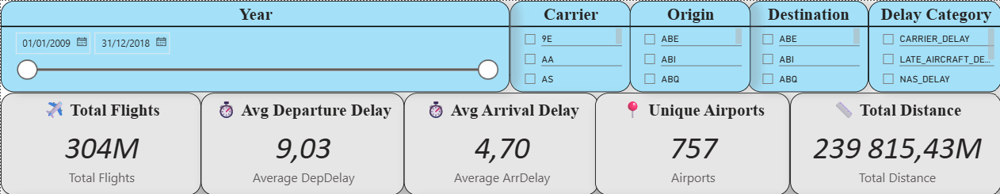
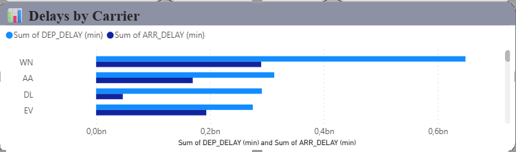
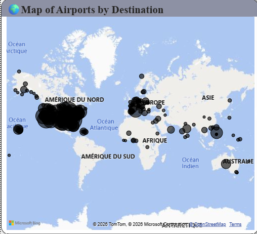

# ✈️ Airline Delay & Cancellation Dashboard

## 📌 Business Context
Airlines face operational challenges due to flight delays and cancellations, which impact customer satisfaction and costs.
This dashboard helps decision-makers identify delay patterns, problematic airlines, routes, and main causes of delays.

---

## 🎯 Objectives
- Analyze flight delays and cancellations
- Identify airlines and routes with highest delays
- Understand delay reasons
- Track monthly and yearly delay trends

---

## 🧰 Tools & Technologies
- Power BI
- Power Query (Data Cleaning)
- DAX (Measures & KPIs)

---

## 📊 Key KPIs
- Total Flights
- Delayed Flights %
- Cancelled Flights %
- Average Delay Time (minutes)

---

## 📈 Dashboard Features
- Delay trends by month
- Delays by airline
- Cancellation reasons analysis
- Interactive slicers (Year, Airline, Airport)
- Geographic visualization (Routes / Airports)

---

## 🔍 Key Insights
- Certain airlines consistently experience higher delays
- Peak delays occur during specific months (seasonality effect)
- Weather and operational issues are top delay causes

---

## 💡 Recommendations
- Optimize schedules during high-delay months
- Improve operations for frequently delayed airlines
- Enhance contingency planning for weather-related delays

---

## 📁 Dataset
Source: [Public airline delay dataset (Kaggle)](https://www.kaggle.com/datasets/yuanyuwendymu/airline-delay-and-cancellation-data-2009-2018)

---

## 📸 Dashboard Screenshots

### Overview

### Delay Analysis

### Airports Map

