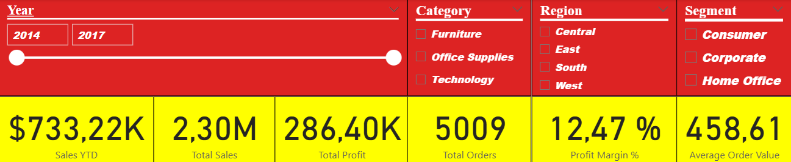
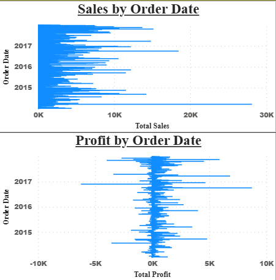
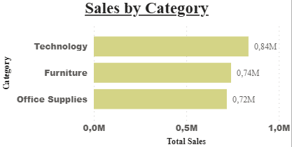
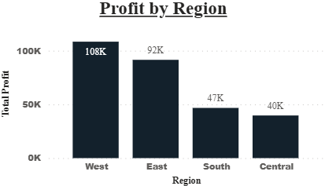
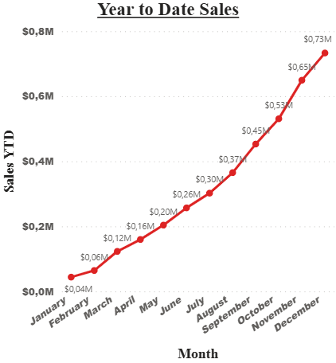

# 📈 Project KPI : Finance & Sales Performance Dashboard

## 📌 Business Context
This project is an **interactive KPI Dashboard** built using **Power BI**, designed to analyze **Sales, Profit, Orders, and Performance trends** for a retail company using the **Superstore dataset**.
The dashboard provides a **high-level executive view** as well as **detailed analytical insights**, helping decision-makers understand business performance across **time, categories, regions, and customer segments**.

---

## 🎯 Objectives
- Monitor key financial and sales KPIs
- Track **Year-To-Date (YTD) Sales performance**
- Analyze profitability by **region and category**
- Evaluate customer purchasing behavior using **Average Order Value**
- Enable interactive exploration through slicers and filte

---

## 🧰 Tools & Technologies
- Power BI
- Power Query (Data Cleaning)
- DAX (Measures & KPIs)

---

## 📊 Key KPIs
- Sales YTD
- Total Sales
- Total Profit
- Profit Margin (%)
- Total Orders
- Average Order Value

---

## 📈 Dashboard Features
- Interactive Year, Category, Region, and Segment slicers
- KPI Cards for quick performance overview
- Line chart for Year-To-Date Sales trend
- Bar charts for Sales by Category and Profit by Region
- Clean, business-oriented layout suitable for executives

---

## 🔍 Key Insights
- Technology category generates the highest sales
- West region shows the strongest profitability
- Sales performance varies significantly by customer segment
- YTD analysis highlights seasonal sales trends

---

## 💡 Recommendations
- Focus on High-Profit Regions
- Optimize Low-Margin Categories
- Improve Performance in Underperforming Regions
- Monitor Sales Trends Over Time

---

## 📁 Dataset
- Source: [Superstore Dataset (Kaggle)](https://www.kaggle.com/datasets/vivek468/superstore-dataset-final)

---

## 📸 Dashboard Screenshots

### Overview

### Sales-And-Profit-by-Order-Date

### Sales-by-Category

### Profit-by-Region

### Year-to-Date-Sales

