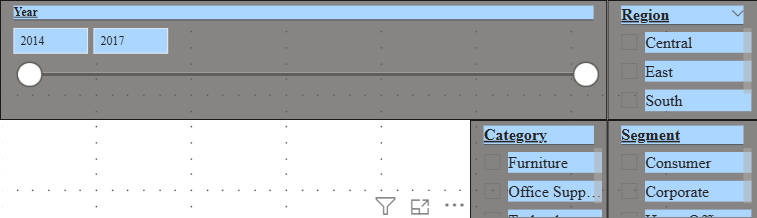
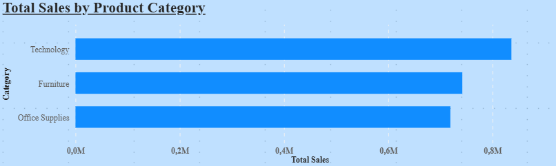

# 📊 Finance & Sales Performance Dashboard

## 📌 Business Context
This project presents an interactive **Finance & Sales Performance Dashboard** built using **Power BI**, designed to provide a comprehensive overview of sales, profitability, and customer performance across multiple business dimensions.
The dashboard enables stakeholders to monitor key financial KPIs, analyze trends over time, and identify high-performing regions, categories, and customer segments.

---

## 🎯 Objectives
- Analyze **sales and profit performance** over time
- Identify **top-performing regions and product categories**
- Evaluate **customer-level contribution** to revenue and profit
- Enable **dynamic filtering** for deeper business insights

---

## 🧰 Tools & Technologies
- Power BI
- Power Query (Data Cleaning)
- DAX (Measures & KPIs)

---

## 📊 Key KPIs
- Total Sales
- Total Profit
- Profit Margin (%)
- Total Orders
- Average Order Value

---

## 📈 Dashboard Features
- Sales Over Time : analysis using a dedicated Date Table
- Sales vs Profit : comparison to assess business efficiency
- Sales by Category : breakdown
- Profit by Region : performance analysis
- Customer-level table : for detailed insights
- Interactive slicers for:
  - Year
  - Region
  - Category
  - Segment

---

## 🔍 Key Insights
- Technology category generates the highest sales volume
- West region shows the strongest profitability
- Profitability varies significantly across customer segments
- Sales trends show consistent growth over time with seasonal patterns

---

## 💡 Recommendations
- Focus on High-Profit Regions
- Optimize Low-Margin Categories
- Improve Performance in Underperforming Regions
- Monitor Sales Trends Over Time

---

## 📁 Dataset
- Source: [Superstore Dataset (Kaggle)](https://www.kaggle.com/datasets/vivek468/superstore-dataset-final)

---

## 📸 Dashboard Screenshots

### Overview

### Total Sales By Category

### Overview

### Overview

### Overview

